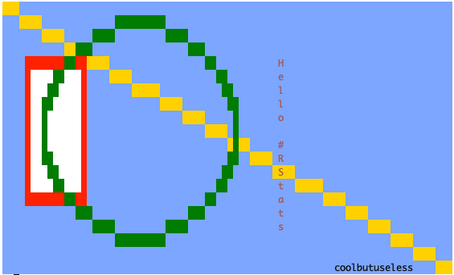
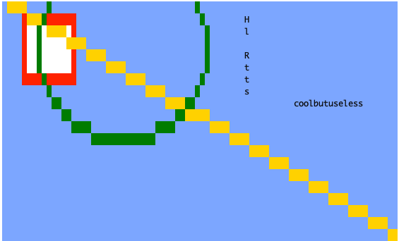
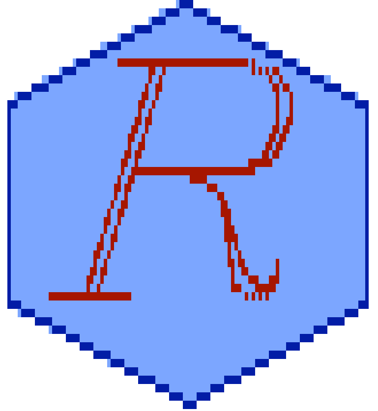
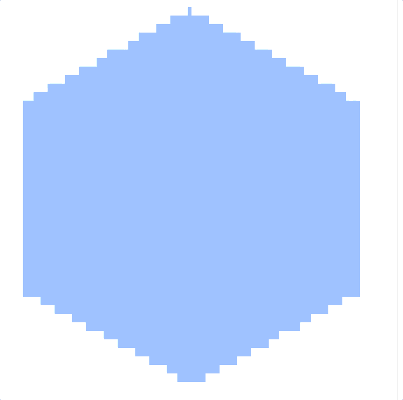

<!-- README.md is generated from README.Rmd. Please edit that file -->

```{r, include = FALSE}
knitr::opts_chunk$set(
  collapse = TRUE,
  comment = "#>",
  fig.path = "man/figures/README-",
  out.width = "100%"
)

library(miniansi)
```


```{r echo = FALSE, eval = FALSE}
# Quick logo generation. Borrowed heavily from Nick Tierney's Syn logo process
library(magick)
library(showtext)
font_add_google("Abril Fatface", "gf")

```


```{r echo = FALSE, eval = FALSE}
img <- image_read("man/figures/mini-cooper-s.gif") %>%
  image_transparent(color = "#f9fafb", fuzz = 10) %>%
  image_trim() %>%
  image_threshold()


hexSticker::sticker(subplot  = img,
                    s_x      = 0.92,
                    s_y      = 1.2,
                    s_width  = 1.5,
                    s_height = 0.95,
                    package  = "ansi",
                    p_x      = 1,
                    p_y      = 0.6,
                    p_color  = "#223344",
                    p_family = "gf",
                    p_size   = 10,
                    h_size   = 1.2,
                    h_fill   = "#ffffff",
                    h_color  = "#223344",
                    filename = "man/figures/logo.png")

image_read("man/figures/logo.png")
```


# miniansi   

<!-- badges: start -->


<!-- badges: end -->


#### `miniansi` is a package for creating simple ANSI documents.


`miniansi` is an R package for creating coloured ANSI output.

`miniansi` currently has quite a minimal feature set, as only enough was included
such that it could act as a graphics output device for R.

## Installation

You can install from [GitHub](https://github.com/coolbutuseless/miniansi) with:

``` r
# install.packages("remotes")
remotes::install_github("coolbutuseless/miniansi")
```

## Future possibilities

* Slice documents, copy one document into another
* Image/raster support
* Manually simulate alpha blending by tinting colours
* Anti-aliasing
* Figlet support

## Simple example of creating an ANSI document

```{r eval = FALSE}
library(miniansi)

doc <- ANSI$new(width = 80, height = 20, background = 'cornflowerblue')
doc$rect(5, 5, 15, 15, colour = 'red', fill = 'white')
doc$line(1, 1, 80, 20, 'gold')
doc$circle(25, 10, r = 17, colour = 'darkgreen', fill = NA)
doc$text(50,  5, "Hello #RStats" , angle = 90, colour = 'brown')
doc$text(60, 20, "coolbutuseless", angle =  0)

doc
```


```{r echo=FALSE, out.width="60%"}

```


# Aspect ratio tweaks

Working with ANSI is often painful due to the fundamental pixel unit not being square.

`miniansi` includes a mode which lets you specify the aspect ratio of the font,
and tries to adjust everything else (by scaling the y values) so that square 
things still look square.

Use the `font_aspect` argument during initialisation to let `miniansi` know
how to compensate for aspect ratio.

This mode has its own problems (as evidenced in the plot below). Note:

The Good:

* The `rect` sides now actually look (nearly) the same length

The Bad:

* Even though the document is only nominally 20 characters high, because of the
  y-coord adjustment, the visible plotting area is larger i.e. `doc$max_height = height/font_aspect`
* Vertical text writing will never work properly in this mode.

The Weird:

* Circles are always fudged by `miniansi` to look circular. This was a deliberate
  choice in order to work sanely with `grid` graphics and `ggplot2::geom_point`


```{r eval = FALSE}
library(miniansi)

doc <- ANSI$new(width = 80, height = 20, background = 'cornflowerblue', font_aspect = 0.45)

max_height <- doc$max_height

doc$rect(5, 5, 15, 15, colour = 'red', fill = 'white')
doc$line(1, 1, 80, max_height, 'gold')
doc$circle(25, 10, r = 17, colour = 'darkgreen', fill = NA)
doc$text(50,  5, "Hello #RStats" , angle = 90, colour = 'black')
doc$text(60, 20, "coolbutuseless", angle =  0)

doc
```


```{r echo=FALSE, out.width="60%"}

```

# Alternate logo - Rendering a vector font to ANSI


```{r eval = FALSE}
library(dplyr)
library(hershey)  # Hershey Vector Fonts: https://github.com/coolbutuseless/hershey

#~~~~~~~~~~~~~~~~~~~~~~~~~~~~~~~~~~~~~~~~~~~~~~~~~~~~~~~~~~~~~~~~~~~~~~~~~~~~~
# Initialise a document
#~~~~~~~~~~~~~~~~~~~~~~~~~~~~~~~~~~~~~~~~~~~~~~~~~~~~~~~~~~~~~~~~~~~~~~~~~~~~~
doc <- ANSI$new(width = 110, height = 50, font_aspect = 0.4, background = 'white')

#~~~~~~~~~~~~~~~~~~~~~~~~~~~~~~~~~~~~~~~~~~~~~~~~~~~~~~~~~~~~~~~~~~~~~~~~~~~~~
# Set some sizes
#~~~~~~~~~~~~~~~~~~~~~~~~~~~~~~~~~~~~~~~~~~~~~~~~~~~~~~~~~~~~~~~~~~~~~~~~~~~~~
w  <- 110
h  <- doc$max_height
ll <- h/2.1

#~~~~~~~~~~~~~~~~~~~~~~~~~~~~~~~~~~~~~~~~~~~~~~~~~~~~~~~~~~~~~~~~~~~~~~~~~~~~~
# Set up a hexagon
#~~~~~~~~~~~~~~~~~~~~~~~~~~~~~~~~~~~~~~~~~~~~~~~~~~~~~~~~~~~~~~~~~~~~~~~~~~~~~
polygon_df <- tibble(
  angle = seq(0, 2*pi, length.out = 7) + pi/6,
  x     = ll * cos(angle) + w/2,
  y     = ll * sin(angle) + h/2
)

#~~~~~~~~~~~~~~~~~~~~~~~~~~~~~~~~~~~~~~~~~~~~~~~~~~~~~~~~~~~~~~~~~~~~~~~~~~~~~
# Draw the polygon
#~~~~~~~~~~~~~~~~~~~~~~~~~~~~~~~~~~~~~~~~~~~~~~~~~~~~~~~~~~~~~~~~~~~~~~~~~~~~~
doc$polygon(polygon_df$x, polygon_df$y, fill = 'cornflowerblue', colour = 'darkblue')

#~~~~~~~~~~~~~~~~~~~~~~~~~~~~~~~~~~~~~~~~~~~~~~~~~~~~~~~~~~~~~~~~~~~~~~~~~~~~~
# Set up the letter R
#~~~~~~~~~~~~~~~~~~~~~~~~~~~~~~~~~~~~~~~~~~~~~~~~~~~~~~~~~~~~~~~~~~~~~~~~~~~~~
letter_r <- hershey::hershey %>%
  filter(char == 'R', font == 'music') %>%
  mutate(
    x = 3.3 *  x,
    y = 3.3 * -y,
    
    x = x + w/2,
    y = y + h/2 + 2
  )


#~~~~~~~~~~~~~~~~~~~~~~~~~~~~~~~~~~~~~~~~~~~~~~~~~~~~~~~~~~~~~~~~~~~~~~~~~~~~~
# Draw the letter
#~~~~~~~~~~~~~~~~~~~~~~~~~~~~~~~~~~~~~~~~~~~~~~~~~~~~~~~~~~~~~~~~~~~~~~~~~~~~~
letter_r %>% 
  group_by(stroke) %>% 
  group_walk(~doc$polyline(.x$x, .x$y, colour = 'darkred'))


#~~~~~~~~~~~~~~~~~~~~~~~~~~~~~~~~~~~~~~~~~~~~~~~~~~~~~~~~~~~~~~~~~~~~~~~~~~~~~
# print
#~~~~~~~~~~~~~~~~~~~~~~~~~~~~~~~~~~~~~~~~~~~~~~~~~~~~~~~~~~~~~~~~~~~~~~~~~~~~~
doc
```


```{r echo=FALSE, out.width="60%"}

```


# Animation

This is a gif capture of this code running in my terminal.  I definitely tweaked the
frame rate up, as capturing a clean set of images in the terminal was hard.

```{r eval=FALSE}
library(miniansi)
library(dplyr)
library(hershey)  # Hershey Vector Fonts: https://github.com/coolbutuseless/hershey

#~~~~~~~~~~~~~~~~~~~~~~~~~~~~~~~~~~~~~~~~~~~~~~~~~~~~~~~~~~~~~~~~~~~~~~~~~~~~~
# Set up the positions for each frame
#~~~~~~~~~~~~~~~~~~~~~~~~~~~~~~~~~~~~~~~~~~~~~~~~~~~~~~~~~~~~~~~~~~~~~~~~~~~~~
xoffs  <- seq(135, -265, -10)
angles <- seq(pi/6, pi/2, length.out = length(xoffs))


#~~~~~~~~~~~~~~~~~~~~~~~~~~~~~~~~~~~~~~~~~~~~~~~~~~~~~~~~~~~~~~~~~~~~~~~~~~~~~
# Loop over all frames
#~~~~~~~~~~~~~~~~~~~~~~~~~~~~~~~~~~~~~~~~~~~~~~~~~~~~~~~~~~~~~~~~~~~~~~~~~~~~~
for (idx in seq_along(xoffs)) {
  
  xoff  <- xoffs[idx]
  angle <- angles[idx]
  
  #~~~~~~~~~~~~~~~~~~~~~~~~~~~~~~~~~~~~~~~~~~~~~~~~~~~~~~~~~~~~~~~~~~~~~~~~~~~
  # Set up an ANSI document
  #~~~~~~~~~~~~~~~~~~~~~~~~~~~~~~~~~~~~~~~~~~~~~~~~~~~~~~~~~~~~~~~~~~~~~~~~~~~
  doc <- ANSI$new(width = 110, height = 50, font_aspect = 0.4, background = 'white')

  #~~~~~~~~~~~~~~~~~~~~~~~~~~~~~~~~~~~~~~~~~~~~~~~~~~~~~~~~~~~~~~~~~~~~~~~~~~~
  # Define some sizes
  #~~~~~~~~~~~~~~~~~~~~~~~~~~~~~~~~~~~~~~~~~~~~~~~~~~~~~~~~~~~~~~~~~~~~~~~~~~~
  w  <- 110
  h  <- doc$max_height
  ll <- h/2.3
  
  
  #~~~~~~~~~~~~~~~~~~~~~~~~~~~~~~~~~~~~~~~~~~~~~~~~~~~~~~~~~~~~~~~~~~~~~~~~~~~
  # draw a rotated hexagon
  #~~~~~~~~~~~~~~~~~~~~~~~~~~~~~~~~~~~~~~~~~~~~~~~~~~~~~~~~~~~~~~~~~~~~~~~~~~~
  polygon_df <- tibble(
    angle = seq(0, 2*pi, length.out = 7) + angle,
    x     = ll * cos(angle) + w/2,
    y     = ll * sin(angle) + h/2
  )
  
  doc$polygon(polygon_df$x, polygon_df$y, fill = 'cornflowerblue', colour = NA)
  
  
  #~~~~~~~~~~~~~~~~~~~~~~~~~~~~~~~~~~~~~~~~~~~~~~~~~~~~~~~~~~~~~~~~~~~~~~~~~~~
  # Create a word in the hershey 'meteorology' font
  #~~~~~~~~~~~~~~~~~~~~~~~~~~~~~~~~~~~~~~~~~~~~~~~~~~~~~~~~~~~~~~~~~~~~~~~~~~~
  rstats <- hershey::create_string_df("RStats", font = 'meteorology') %>%
    mutate(
      x = 3 *  x,
      y = 3 * -y,
      y = y + h/2,
      x = x + xoff  # (-2*w-45), w+25 => -265, 135
    )
  
  #~~~~~~~~~~~~~~~~~~~~~~~~~~~~~~~~~~~~~~~~~~~~~~~~~~~~~~~~~~~~~~~~~~~~~~~~~~~
  # Draw the word using polylines for each stroke for each character
  #~~~~~~~~~~~~~~~~~~~~~~~~~~~~~~~~~~~~~~~~~~~~~~~~~~~~~~~~~~~~~~~~~~~~~~~~~~~
  rstats %>% 
    group_by(char_idx, stroke) %>% 
    group_walk(~doc$polyline(.x$x, .x$y, colour = 'darkred'))
  
  #~~~~~~~~~~~~~~~~~~~~~~~~~~~~~~~~~~~~~~~~~~~~~~~~~~~~~~~~~~~~~~~~~~~~~~~~~~~
  # Print the frame, reset the cursor to top of screen for a slightly 
  # cleaner render
  #~~~~~~~~~~~~~~~~~~~~~~~~~~~~~~~~~~~~~~~~~~~~~~~~~~~~~~~~~~~~~~~~~~~~~~~~~~~
  print(doc)
  cat("\033[0;0H")
  Sys.sleep(0.2)
}
```





